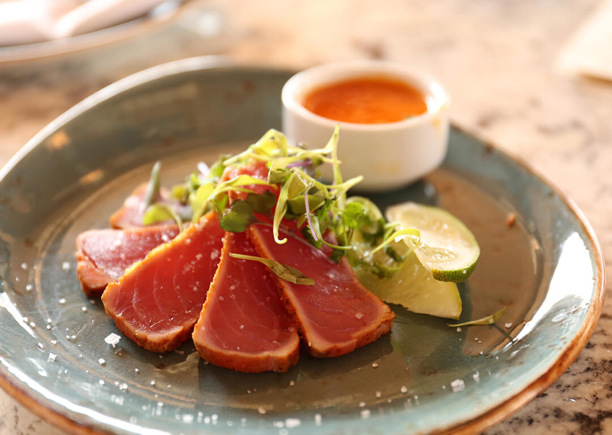
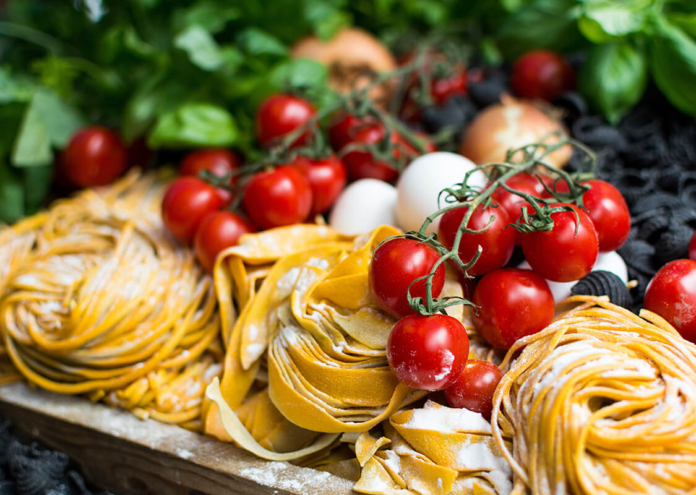

# Tips
- container
  - container
  - container-fluid
- row
  - col 平分
    ```
    <div class="row">
        <div class="col">
        </div>
    </div>
    ```
- image
  - 響應式圖式，隨畫面圖多時自動縮小
    
    ```
    <div class="col">
        
    </div>
    ```
  - w-100

    ```
      <div class="w-100"></div>
    ```
- 12 grid
  - col-n 總和為12
    ```
    <div class="col-4">
        
    </div>
    <div class="col-2">
        
    </div>
    <div class="col-6">
        
    </div>
    ```
    - col-sm-n 套用在 576~ 範圍
    - col-lg-n 套用在 992~ 範圍
    - 可以一次用2個 style 決定在不用尺寸下如何分配
      - e.g. 螢幕越小分越少欄，螢幕越寬分越多欄
  - 巢狀 (lesson-13)
    - div.row > div.col-sm6 > div.row > div.col-sm6
      - 子層要用 row 包起來
    - no-gutters 可以去除間隔 
- 